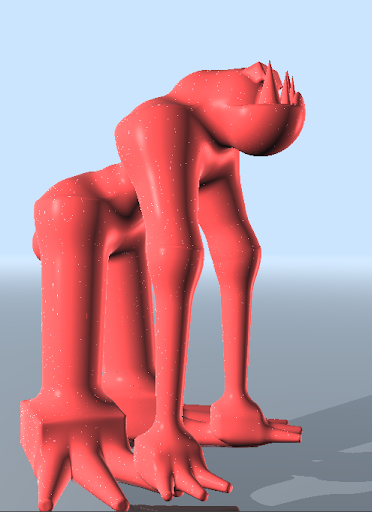
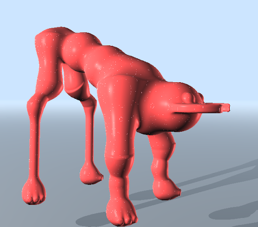
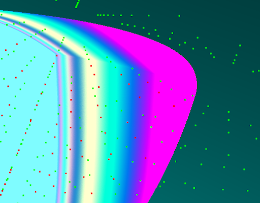
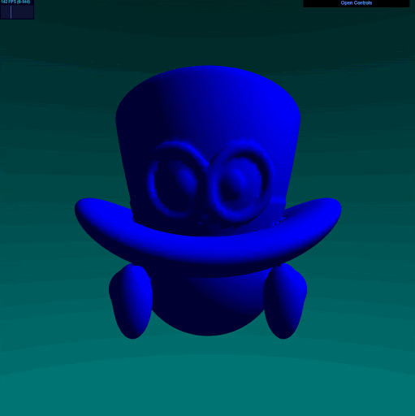
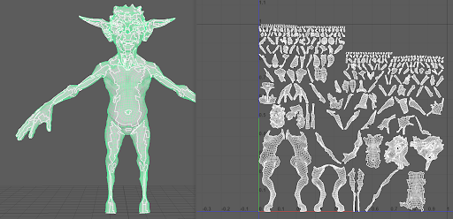
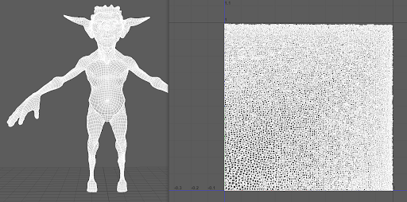
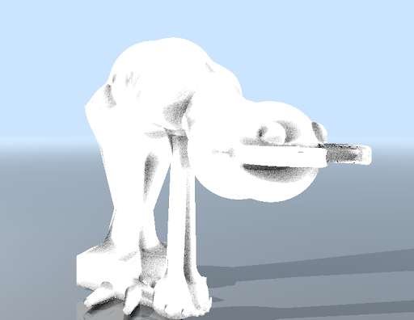
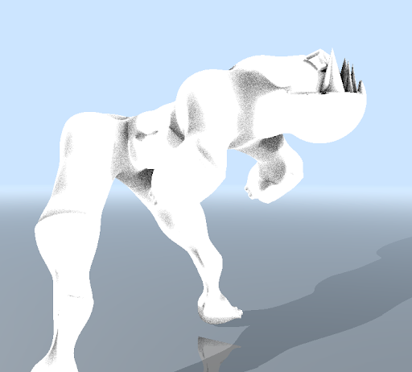
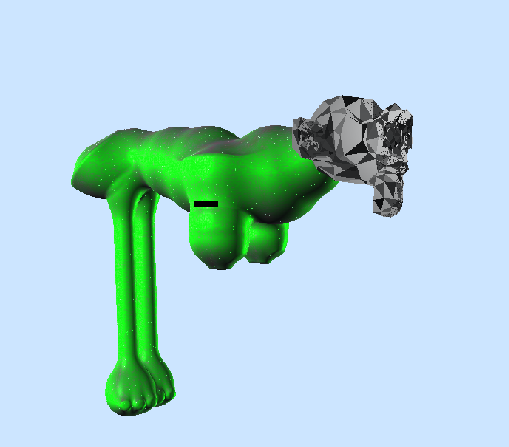
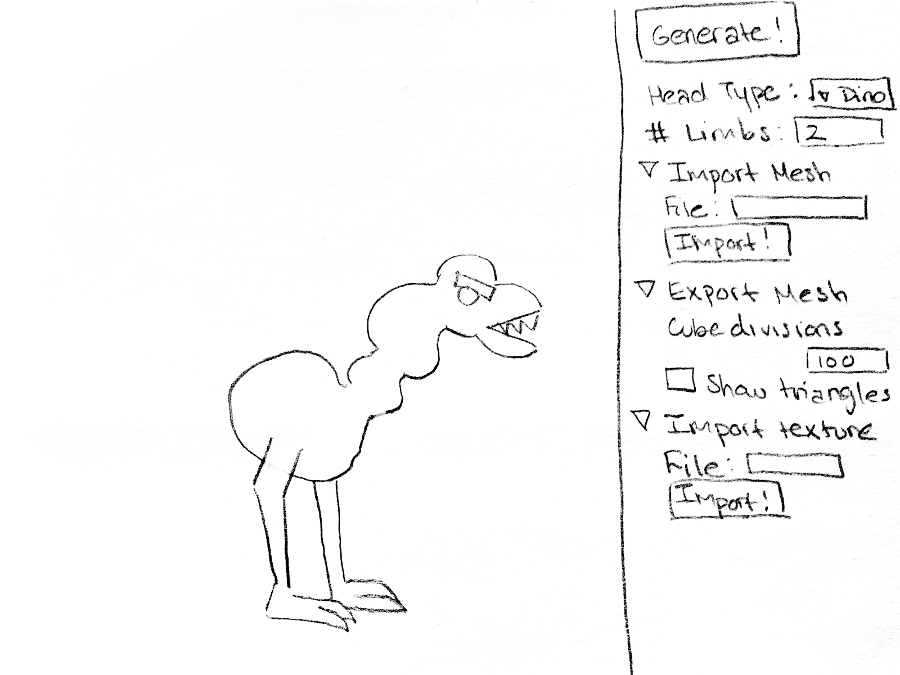

# Pudgy Pals 2.0.0: Even Pudgier

### Group Members: Alexis Ward, Joshua Nadel, Tabatha Hickman

## Contact Us:
- Alexis Ward
  - [LinkedIn](https://www.linkedin.com/in/alexis-ward47/), [Website](https://www.alexis-ward.tech/)
- Joshua Nadel
  - [LinkedIn](https://www.linkedin.com/in/joshua-nadel-379382136/), [Website](http://www.joshnadel.com/)
- Tabatha Hickman
  - [LinkedIn](https://www.linkedin.com/in/tabatha-hickman-335987140/)

# Project Proposal

## Overview:

Our group has been very impressed by the abilities of DXR, and we realized Josh’s old Procedural Creature Generator [Pudgy Pals](https://github.com/nmagarino/Pudgy-Pals-Procedural-Creature-Generator) could really benefit from it. These creatures are created from an assortment of raymarched SDF primitives. View the readme at the link for more information. It has plenty of potential for cool new features that we can now expand on by utilizing modern day GPUs.

This project will explore the possibilities of what DXR can do by experimenting with multiple shader passes, mesh rasterization of SDF shapes, user interface upgrades, and more (depending on how much time we have). 

## Goal Features:
- [x] Procedural characters represented by metaballs and other SDFs raytraced using DXR
- [x] Mesh rasterizer (performed using marching cubes) to convert procedural character into exportable mesh
- [ ] Automatic UV unwrapping
- [x] AO and curvature baker to drive texturing
- [x] Imported meshes and textures
- [x] User interface for character customization
- [ ] Bonus feature: skeleton generation and export

## Milestones:
* 11/18: Convert original project to C++ and DirectX12, identify possible optimizations (acceleration structures, reduce amount of buffers)
* 11/25: Research and begin implementation of mesh rasterization, ambient occlusion baker
* 12/2: Complete mesh rasterization, begin UV unwrapper, add curvature baker
* 12/9: User customization, GLTF exporter

# Features and Optimizations

## Porting Pudgy Pals to C++ and DirectX12

The original Pudgy Pals project was completed in Typescript and WebGL. We thought it would be a simple task to retool this code into c++ and the DirectX12 environment. We thought that the most time-consuming and interesting part would be considering the most efficient ways to transfer the large quantity of uniform variables needed in the shader from CPU to GPU side. However, many tedious roadblocks came up that made this task harder to complete than we originally thought. Firstly, we had to convert all the SDF and other shader code from glsl to hlsl. One of the major differences in these two languages is that one does row-major linear algebra while the other does column-major. As a result, transformations were not occurring correctly at first because we need to multiply vectors and rotation matrices in the oppposite order. We also had some problems with the structure of AABBs in DirectX. While AABBs are ideal for procedural primitives, they require us to know the bounds of the primitive before it is created, otherwise the primitive could get culled. This caused us some major headaches early on because we had our AABB too small and we were not able to visualize the creature at all. Between these dilemmas and several other small ones, such as std::rand producing terribly unexpected results, it took us about 2 weeks in the 4 week project to complete this feature.

And even after all that work, when we ran the creature generator we were getting really low FPS (10-15), two or three times worse than the original application in WebGL.

## Optimizing SDFs

So one of our next tasks involved optimizing the SDF generation and buffer usage. 

The first change we made was in how rotations were perfromed. Originally, we were creating entire 3D rotation matrices and multiplying a 3-float point by them. However, since many of our rotations are done relative to the x, y, and z axes, we realized we only needed 2d matrices and could perform the transformation on two isolated coordinates of the point. For example, if I wanted to rotate on the y axis, I need only transform the x and z coordinates of the point. This is a small but easily accomplished optimization.

Another big change involved how joint transformations were transferred from to the GPU. Each joint in the limbs of the creatures has a rotation calculated based on the vector between it and the next joint on the limb. Previously, these rotation transformations were sent as an array of 4x4 matrices. To reduce the size of this buffer, we changed this to an array of floats, 4 per joint, one for angle and three for the axis about which the rotation should occur. With just this information, a rotation matrix can quickly be constructed in the shader to perform the correct rotation.

Finally, the largest optimization of all involved accessing the uniform variables in the shader. The information passed through the buffers, including data about head and spine positions, joint positions and sizes, appendage locations and types, and more, is accessed many different times by many different SDF functions. At first, we didn't think this would be a problem because such operations are not outside the regular of shader capabilities. However, it became apparent that the quantity of times we were accessing those large arrays holding the information was the cause of the major drop in FPS. To combat this, we found that accessing memory local to the shader was much faster. In other words, we created global variables in the shader identical to the uniform variables, filled them with the data from the uniform variables once at the beginning of the shader's execution, and accessed those instead of the real uniform variables throughout the shader code. This greatly improved the FPS so that the character is rendered in as high as 35-40 frames per second.

## Marching Cubes

One of the more major features we took on in this project was rasterizing thhe SDF surfaces into a triangle mesh. We accomplished this using the marching cubes algorithm. First, the volume encapsulating the SDF is split into a voxelized grid. Then at each point in the grid, the SDF is evaluated to determine if the point is within the surface or not, and if so by how much. You can see this process in the first image below, where each point in the grid has been colored green if it is outside the surface and red if it is inside. Next each cube in the grid is examined and, based on how far the corners of the cube are into the surface, the scenario is categorized into one of more than 15 cases and some number of triangles is produced to represent the mesh in that area, placed by interpolating along the corners. The result is displayed in the GIF below.

This algorithm was first developed and tested in a separate application using WebGL and typescript (see Cappy images below). Then it was migrated into our DirectX application.

## Optimizations
TODO: Alexis

## Automatic UV Unwrapping
Because the original plan was to export textured creature meshes, we would need a system in place to UV unwrap arbitrary meshes. Research revealed different options for implementing this.

### Cubic Mapping

Cubic mapping creates 6 sets of planar-projected UV faces - one for each face of an enclosing cube. Each face is assigned to a planar projection based on their closest normals; front/back, left/right, and top/bottom facing faces are grouped together and projected flat onto the plane they are assigned to. Adjacent faces in the same plane are sown together into shells. However, those shells may overlap in space when projected to a plane; a sophisticated layout technique is needed to optimally arrange all generated shells in UV space such that none of them overlap and the area granted to each face is maximized relative to 3D scale. 3D modeling packages such as Maya and Houdini offer triplanar mapping as a standard UV unwrapping method.

### Per-Face Mapping

Per-face mapping places each face independently one after the next in UV space, starting in the top left corner and proceding by column then row, forming a grid-like arrangement. The entire grid is then uniformly scaled to occupy a 1 by 1 UV space. Though easy to compute and spatially efficient, the texture maps used for meshes UV mapped in this fasion are unreadable to the human eye since the textures are completely discontinuous across edges. Still, for textures that are only baked to and read from - never painted on by hand or manipulated in UV space - this is completely acceptable.

## Ambient Occlusion

Ambient occlusion is computed by calculating the ratio of hitting to missing rays emitting from given points on the sdf surface. We sampled these rays on a normal-aligned hemisphere with uniform weighting.

## Texturing

Our original goal was to provide the ability for users to import images of various file types and use them to texture the creature's surface. We attempted to create a shader resource view buffer for the texture, load the texture and upload it to the gpu. This worked for a simple SDF, but with more complex SDFs that were needed to create the creature, the code addition would cause the window to open but then stall and not display anything. As throughout this project we were expereiencing stack overflow issues in the shader code, we believe that somehow this was a tipping point where we just had too much information for the program to run.

Instead, we decided to have some fun and create procedural textures for the creatures using several variations of Perlin noise functions and random colors.

## Importing Meshes

This was another feature we had wanted to allow full user customization. Using tiny obj loader we were able to import obj files and create vertex and index buffers to send the information to the GPU. In the image below you can see an example of an imported monkey head, which we placed in the same position as a head would be on the creature.

## User Interface

Because we imagined this as an application to be used by an artist, allowing them to tailor and tinker with the characteristics of the creature, we had hoped to have a vast user interface (see drawn outline below). We found that the UI library which seemed best integrated with DirectX12 and which others had success with was imgui. However, we seem to have fallen on a bug which not even the imgui developers know how to solve. Despite the gui initializing and rendering properly, it does not display on the screen of our application.

Meanwhile, we attempted to use other gui frameworks such as AntTweakBar, but found that their lack of a version specifically meant for DirectX12 caused them to fail with our application.

The best we could do by the final project milestone was add key press events which change the creature parameters and regenerate the creature. Here is a list of them.

1 - Generate creature with 1 set of limbs

2 - Generate creature with 2 sets of limbs

3 - Generate creature with 3 sets of limbs

B - Generate creature with Bug head type

D - Generate creature with Dino head type

T - Generate creature with Troll head type

R - Generate creature with Random head type

# References:
[Original Pudgy Pals repo](https://github.com/nmagarino/Pudgy-Pals-Procedural-Creature-Generator)

[DirectX CIS 565 Homework Assignment](https://github.com/CIS565-Fall-2019/Project5-DirectX-Procedural-Raytracing)

[Spore Creature Generation](http://chrishecker.com/My_liner_notes_for_spore#Creature_Skin_Mesh)

TODO: Add links to marching cubes references
[Marching Cubes](TODO)

TODO: Add links to UV unwrapping references
[UV Unwrapping](TODO)
